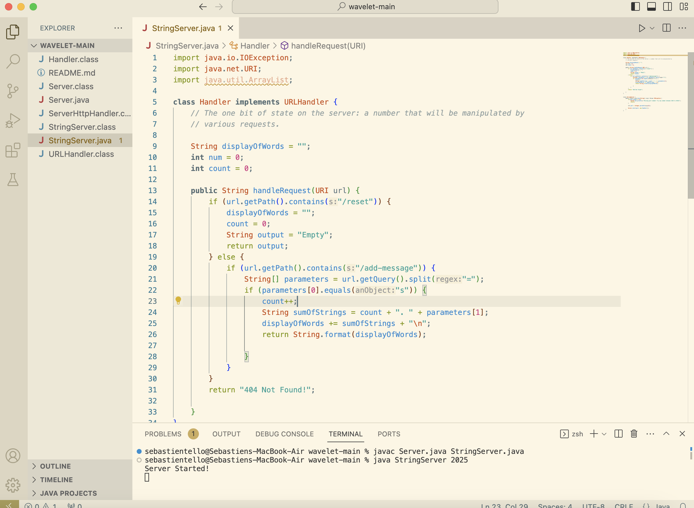
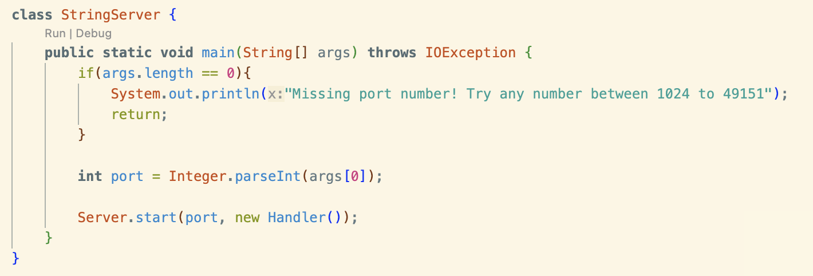
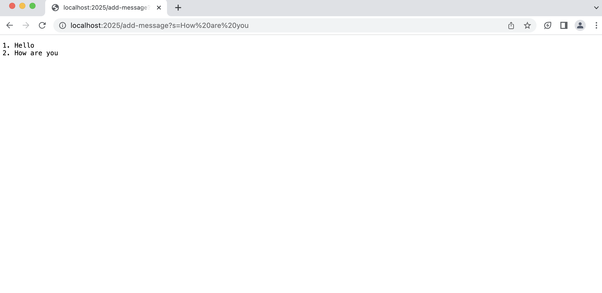
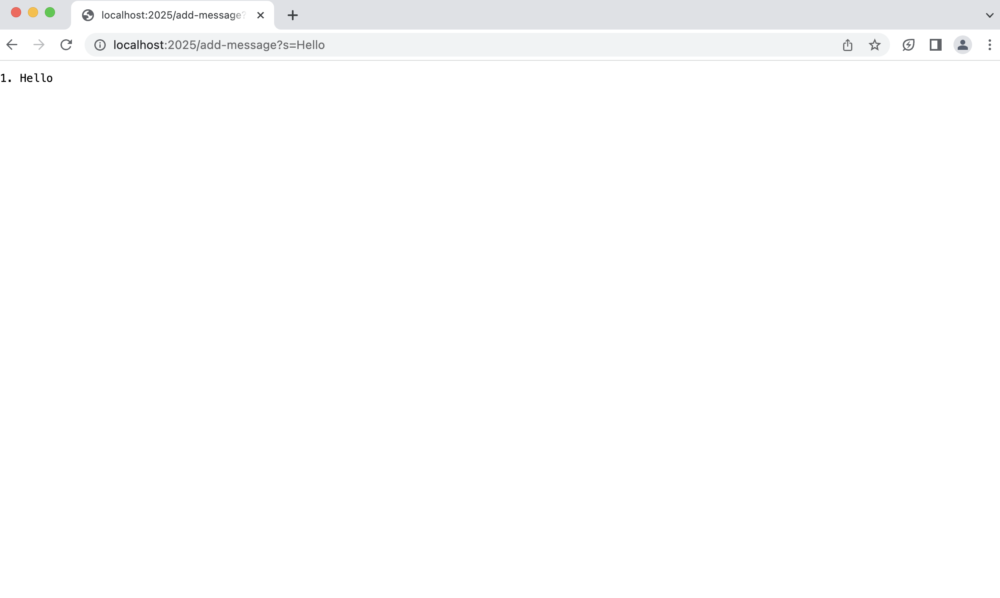
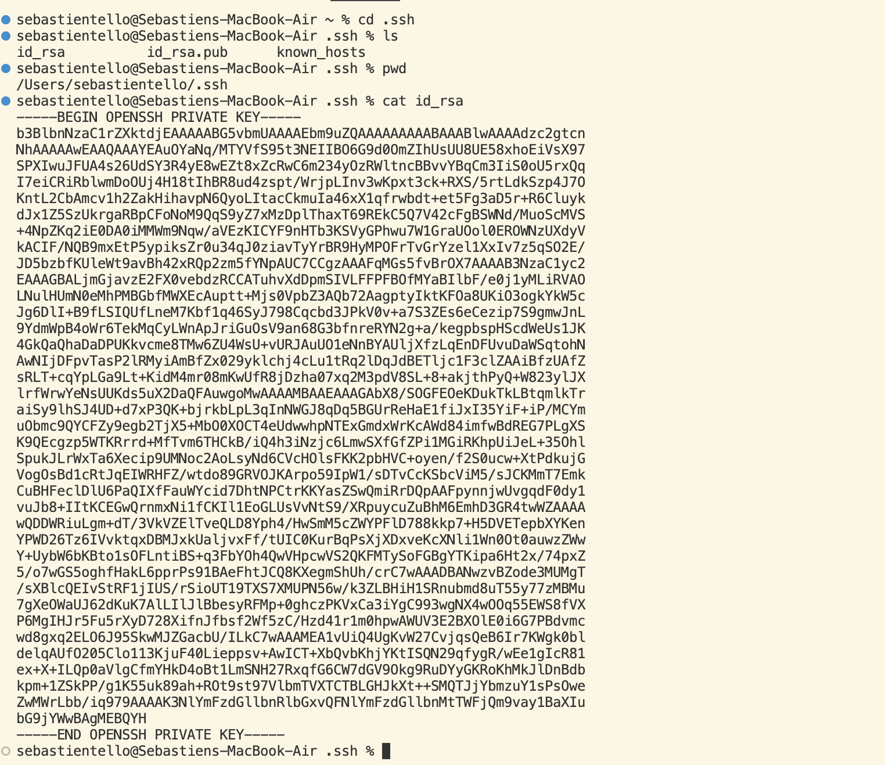
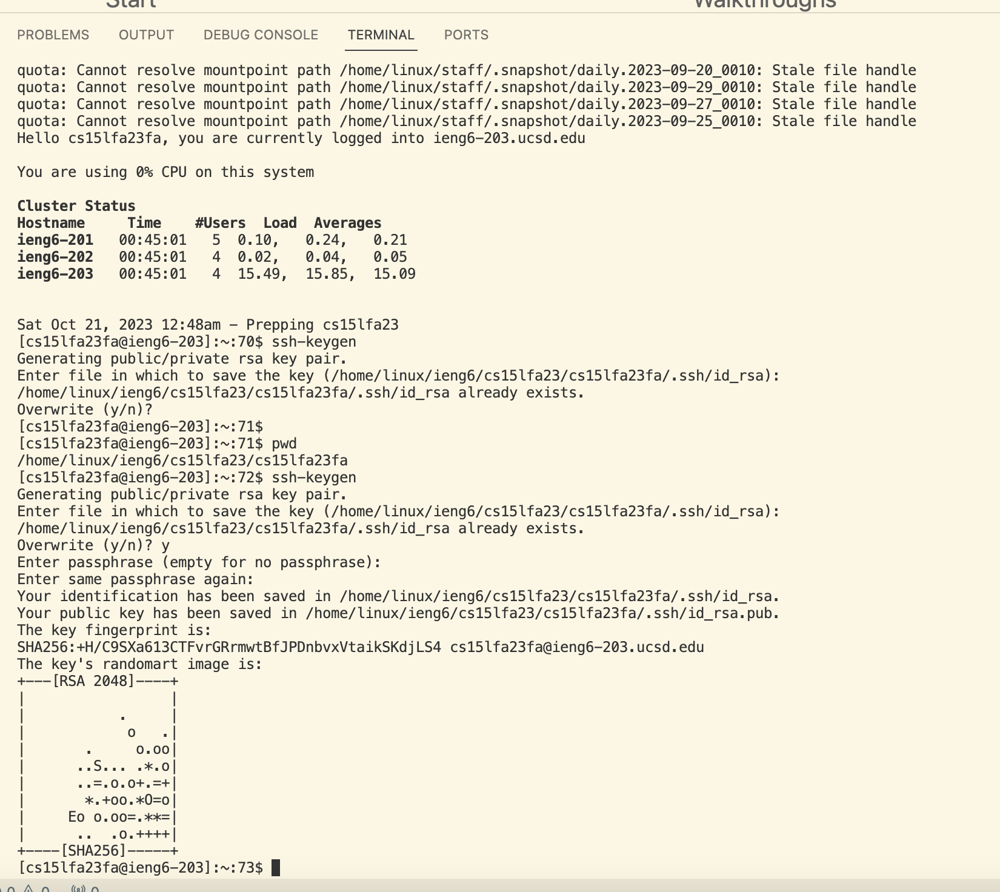
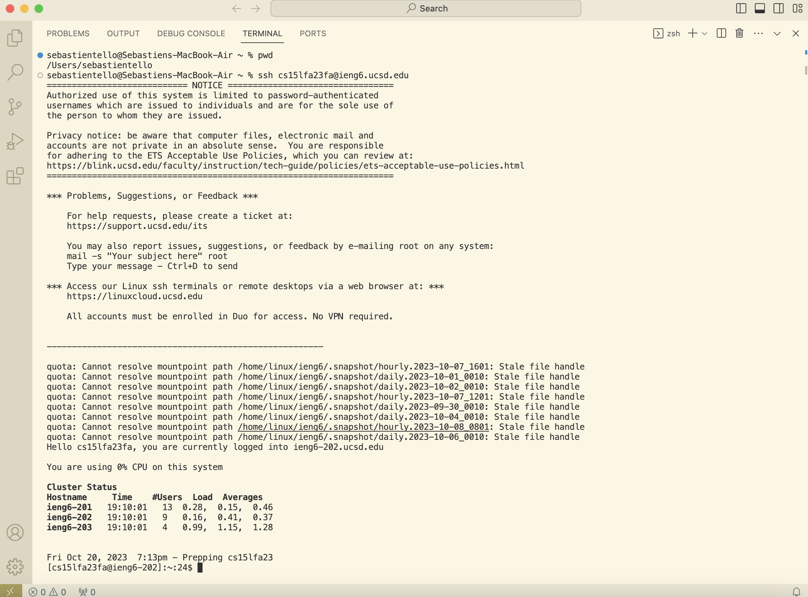

# Lab Report 2

## Part 1
In the code below, the method called is the `handleRequest` method and the `main` method. The `main` method is what creates the website based on the port number inputted by the user. The `handleRequest` method takes in a url as an argument to disect it. The relevant fields of the url is the path and query. The method looks for the correct path to add the message which is `/add-message`. The code also checks conditons on the query of the url to determine what messges should be added to the server which is used by typing `s=__` at the end of the path. The value of the url components change based on what is inputted into the query. 

Additionally, there are two important values belonging to the class. `displayOfWords` is a string variable that accumulates the lines of the numbered messages being added to the url. The end of the url changes when I add different messages. `count` is an integer value that updates to keep track of the number of messages. This value is casted into a string to be displayed as well (when added to the main string) and gets changed every time a new query is inputted. For testing purposes, I also created a condition to reset the values. If the path in the url is `/reset`, the list of messages in the string varibale will be reset to an empty string and the count of messges will be reset to zero.

Here is the code:

Here are 2 examples of the server working: 

As mentioned earlier, the methods used to call and run the website server are the `handleRequest` method and the `main` method. The relevant values for the `main` method is the port number, which I used port 2025 for my website. The relevant values for the `handleRequest` method is the path and query. The value of the query changes based on the specific request of the user's input of what they want to add to the messages. The `/add-message` path shouldn't change if we want to keep adding messages to the website. In this example, I inputted `/add-message` as the path and 'Hello' as the query. This results in the output of '1. Hello'.

  
As mentioned earlier, the methods used to call and run the website server are the `handleRequest` method and the `main` method. The relevant values for the `main` method is the port number, which I used port 2025 for my website. The relevant values for the `handleRequest` method is the path and query. The value of the query changes based on the specific request of the user's input of what they want to add to the messages. In this example, I inputted `/add-message` as the path and 'How Are You' as the query. The `/add-message` path shouldn't change if we want to keep adding messages to the website. The count of the strings gets incremented by 1 each time a string is added. This is another value that changes based on the amount of times strings are added to the website. This results in the output of '2. How Are You'.

## Part 2

Path to private key: /Users/sebastientello/.ssh/id_rsa

Path to public key: /home/linux/ieng6/cs15lfa23/cs15lfa23fa/.ssh/id_rsa.pub.

Account Terminal Interaction w/o password:

## Part 3
Something I learned in week 1 and 2 that I found super cool was learning how to work with urls. I learned how to use java libraries and imported functionalities to start and manipulate web servers with basic code. This also helped me become more familiar with the commands in the command line for starting servers and understanding the directories I am working in.  
