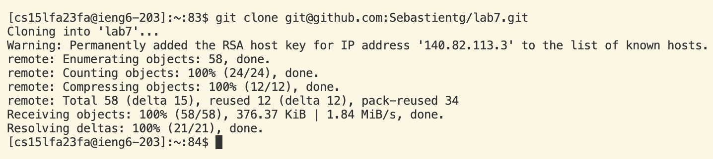

# Lab 4 Report

**STEPS:** 

Log into ieng6 -

I began by opening the terminal with my mouse pad. I then typed in `ssh` followed by my login `cs15lfa23fa@ieng6.ucsd.edu`. I then pressed `<enter>`. I then entered my password then pressed `<enter>` again. 

Clone your fork of the repository from your Github account (using the SSH URL)- 

With my mouspad I went over to the fork of the repository to copy and paste the ssh link for the terminal. I highlighted the link with my mouse and pressed `<Cmd-c>` to copy the link. I then went back over to VSCode and used the command `git clone` followed by `<Cmd-v>` to paste the ssh url. I then pressed `<enter>` to run the command. This overall terminal command was used to clone a repository onto my ieng6 account, considering my account was already a recognized host. 

Run the tests, demonstrating that they fail-

Edit the code file to fix the failing test-

Run the tests, demonstrating that they now succeed-

Commit and push the resulting change to your Github account (you can pick any commit message!)- 

