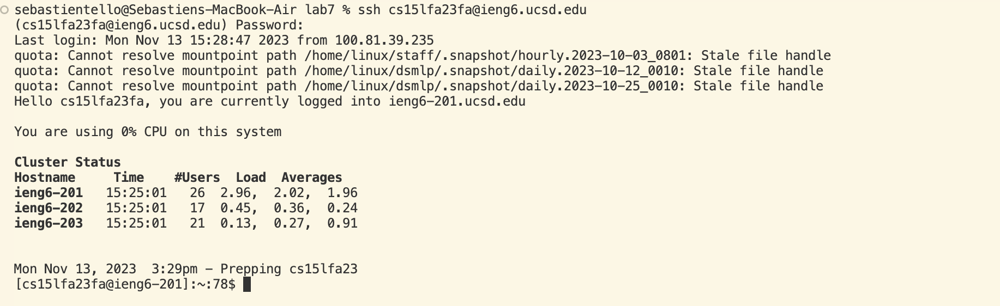

Lab 4 Report

STEPS: 

Log into ieng6 -
I began by opening the terminal with my mouse pad. I then typed in `ssh` followed by my login `cs15lfa23fa@ieng6.ucsd.edu`. I then pressed `<enter>`. I then entered my password then pressed `<enter>` again. 

Clone your fork of the repository from your Github account (using the SSH URL)- 
keys pressed: 

Run the tests, demonstrating that they fail-
keys pressed:

Edit the code file to fix the failing test-
keys pressed:

Run the tests, demonstrating that they now succeed-
keys pressed:

Commit and push the resulting change to your Github account (you can pick any commit message!)-
keys pressed

