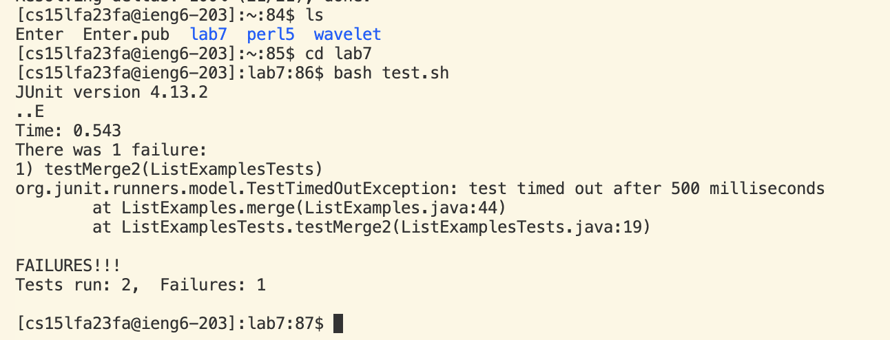
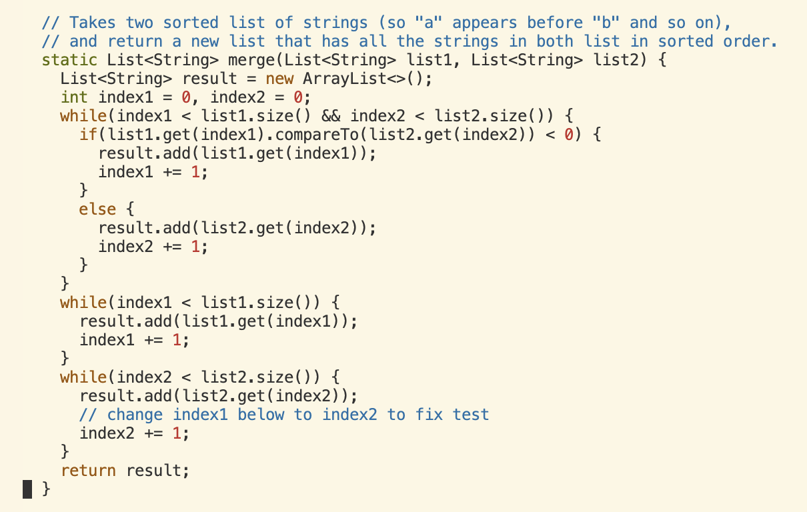

# Lab 4 Report

**STEPS:** 

## Log into ieng6 -

I began by opening the terminal with my mouse pad. I then typed in `ssh` followed by my login `cs15lfa23fa@ieng6.ucsd.edu`. I then pressed `<enter>`. I then entered my password then pressed `<enter>` again. 

## Clone your fork of the repository from your Github account (using the SSH URL)- 

With my mouspad I went over to the fork of the repository to copy and paste the ssh link for the terminal. I highlighted the link with my mouse and pressed `<Cmd-c>` to copy the link. I then went back over to VSCode and used the command `git clone` followed by `<Cmd-v>` to paste the ssh url. I then pressed `<enter>` to run the command. This overall terminal command was used to clone a repository onto my ieng6 account, considering my account was already a recognized host. 

## Run the tests, demonstrating that they fail- 

I first typed out the command `ls` then `<enter>` to check if the correct repository was on my account. The then typed `cd` follwed by `lab7` then pressed `<enter>`. This command put me in the correct directory to run tests. To run tests, I typed `bash test.sh` in the terminal followed by the key `<enter>`. The command ran the proper tests and displayed the failures.  

## Edit the code file to fix the failing test-

I started off editing the ListExamples.java file. To edit the file, I used the terminal to run the command `vim ListExamples.java`. This opened the text editor. Then, I typed `/index1` to search for the first occurrence of index1 in the file and then pressed `<enter>`. After, I typed `<n>` until I reached the last while occurrence of index1. I then typed `<i>` to enter instert mode in vim. I pressed the `<right>` arrow key six times so that I can `<backspace>` the number 1. Then then pressed the number key `<2>` on my keyboard to create the change. I then pressed `<esc>` followed by `:wq` and `<enter>` to save the edits made and exit out of vim. 

## Run the tests, demonstrating that they now succeed-

## Commit and push the resulting change to your Github account (you can pick any commit message!)- 

