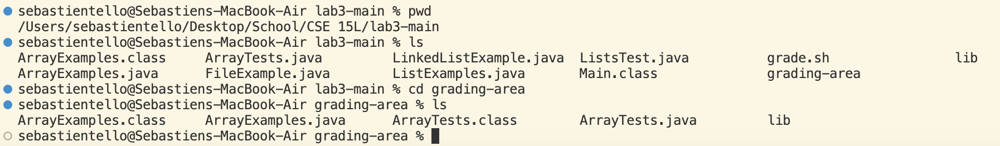

# Lab Report 5

*PART1*
## CSE 15L – Ed Discussion

:smiley:**AnonymousStudent**
> Hello, I really need help on figuring out where I went wrong in my code. I am trying to reverse an arry of integers. I think the bug in my code is in the forloop. I am pretty sure I should traversing through the array backwards. I think a faliure inducing input could just be a simple array with its intergers in order, such as, `{1, 2, 3, 4, 5}`. The method should change the array to `{5, 4, 3, 2, 1}`. I have attached a screen shot of my method below.
> 

:princess:**TA**
> The code you've written would essentially overwrite the original array with its reversed elements, but it doesn't swap the elements correctly! Maybe try using an alternative approach to reversing an array like using pointers and updating them as you traverse through the array. You could also try using `jdb` with the appropriate arguments in the terminal to see where your code is going wrong. You could also create a bash script that tests your code. Hope this helps!
>

:smiley:**AnonymousStudent**
> Thank you for the help. My goal is to reverse the array in place, but this line doesn't achieve that. It overwrites the original array elements with incorrect values. During each iteration of the loop, it assigns the value at the current index `i` of the array to the value at the reversed index `arr.length - i - 1`. This means elements are being overwritten to early, resulting in incorrect values in the array. I found this out by using the java debugger tool in the terminal. This allowed me to see how the local variables were being changed by the method. 
> 
> I have also attached my bash script file and also using it in the terminal to test my file with buggy code.
> 
> 

:princess:**TA**
> Great! I see that you are very close to addressing the bugs in your code!
>

:smiley:**AnonymousStudent**
> To address the issues I used two pointers `start` and `end` to traverse the array from both ends towards the middle. During each iteration, it swaps the elements at the start and end indices, effectively reversing the array in place. This logic ensures that the array elements are correctly swapped without overwriting or losing any values. Here is my fixed code with all my tests passing:
> 
> 
> Here is also my file and directory structure:
> 

*PART2*
## Reflection

In the second half of the quarter, I really enjoyed learning how to use vim in one of the labs. I was able to learn throught the vim tutor tutorial and in class on the how to use it and how it can be useful in the real world. I leanred to how use the text editor in the terminal and the basic commands to edit the text of files. I also thought it was really cool how there are so many different keys to use in vim that can make text editing easier. 

