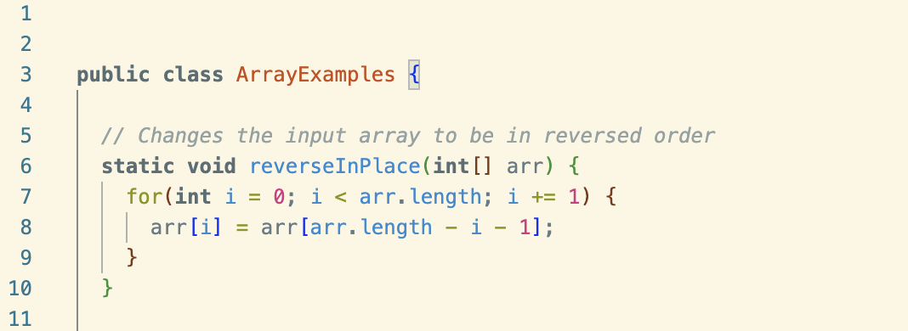

# Lab Report 5

## CSE 15L – Ed Discussion

:smiley:**AnonymousStudent**
> Hello, I really need help on figuring out where I went wrong in my code. I am trying to reverse an arry of integers. I think the bug in my code is in the forloop. I am pretty sure I should traversing through the array backwards. I think a faliure inducing input could just be a simple array with its intergers in order, such as, `{1, 2, 3, 4, 5}`. The method should change the array to `{5, 4, 3, 2, 1}`. I have attached a screen shot of my method below.
> 

:princess:**TA**
> The code you've written would essentially overwrite the original array with its reversed elements, but it doesn't swap the elements correctly! Maybe try using an alternative approach to reversing an array like using pointers and updating them as you traverse through the array. You could also try using `jdb` with the appropriate arguments in the terminal to see where your code is going wrong. Hope this helps!
>

:smiley:**AnonymousStudent**
> Thank you for the help. 
